# Visual guide

Left: saturnos.com reference captures (6 Oct 2026). Right: this app at the same width. Reference images are Saturn's; used only as a design reference for an independent concept.

## Token sheet
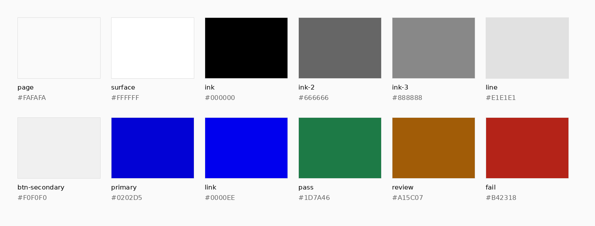

## Reference captures
| Page | Desktop 1366 | Mobile 390 |
|---|---|---|
| Home | 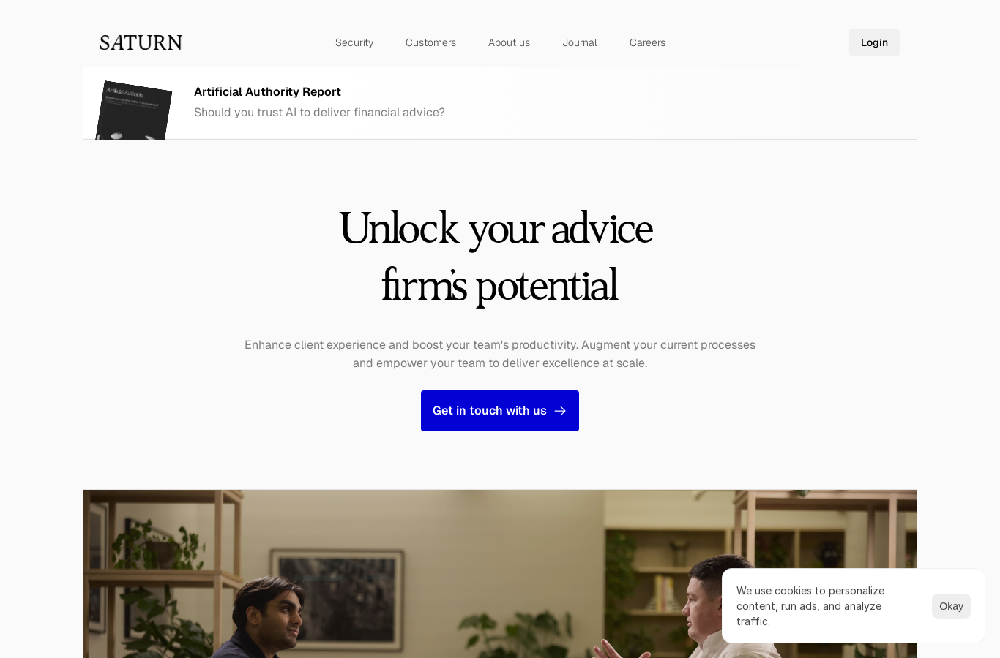 | 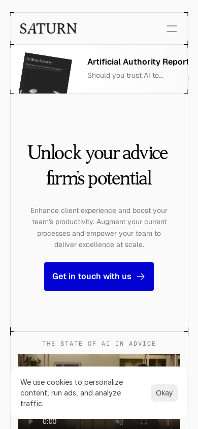 |
| Security | 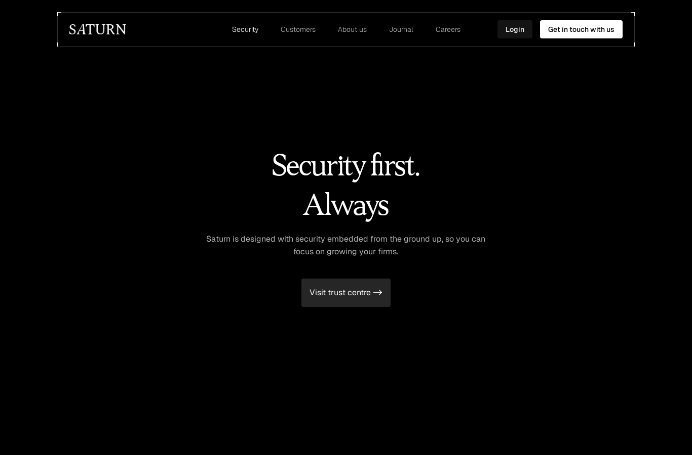 | 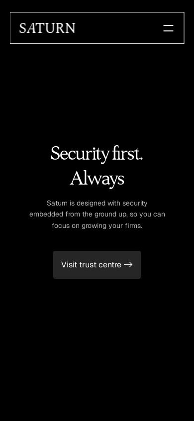 |
| Customers | 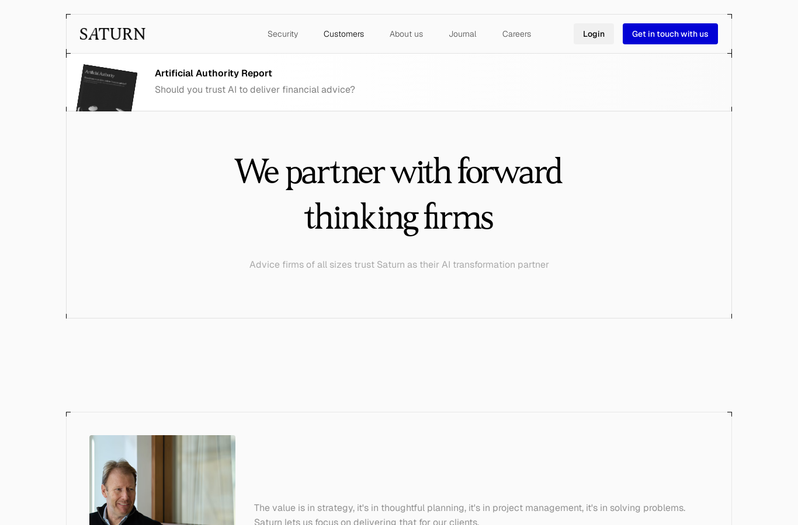 | 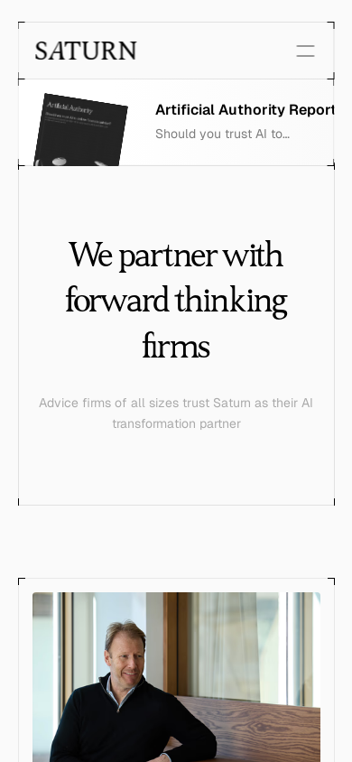 |
| About us | 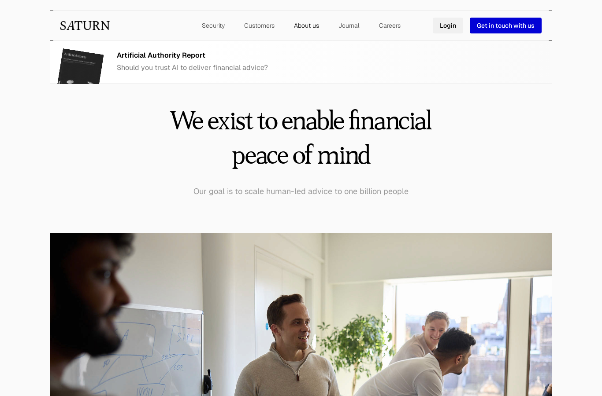 | 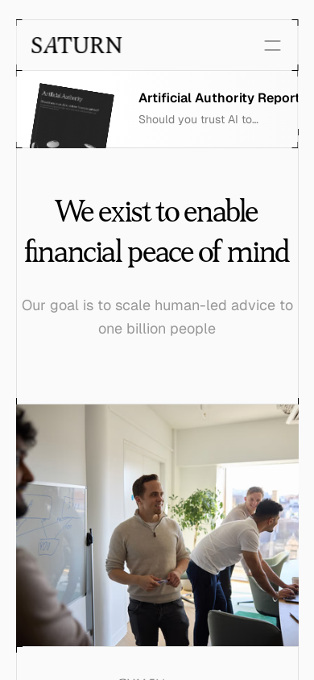 |
| Journal | 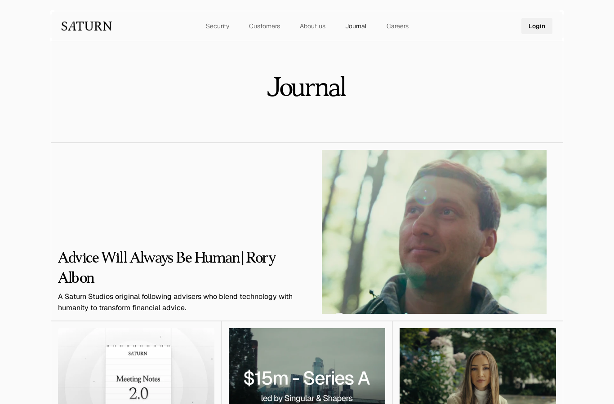 | 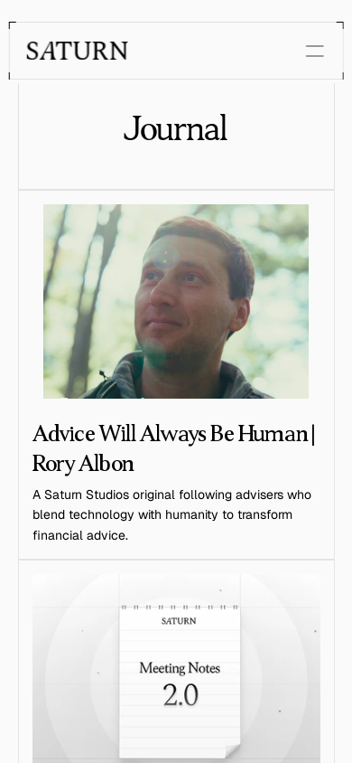 |
| Journal post (Series A) | 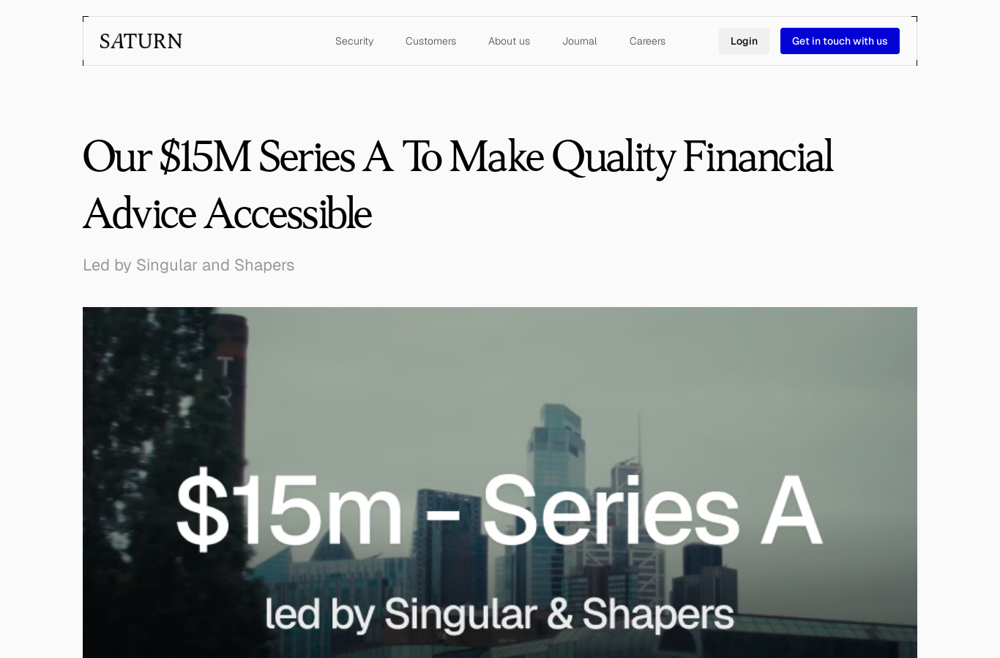 | 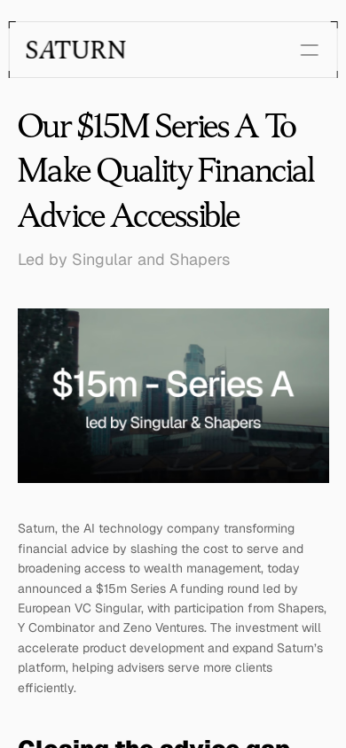 |
| Meeting Notes 2.0 | 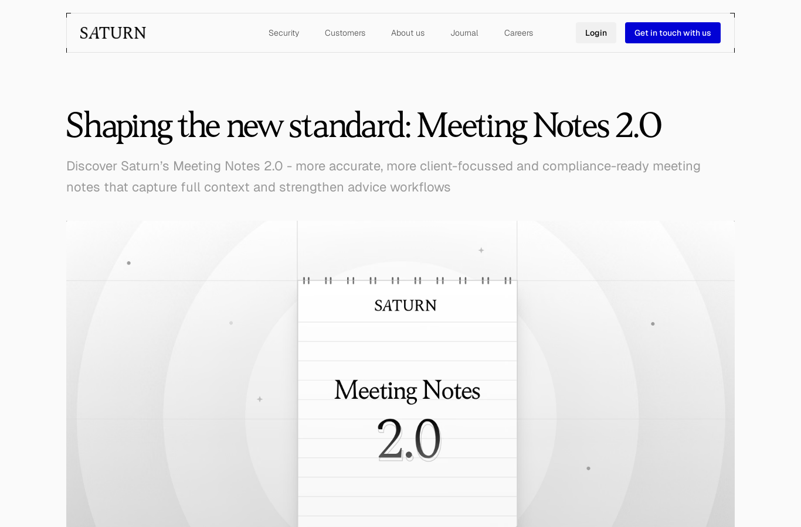 | 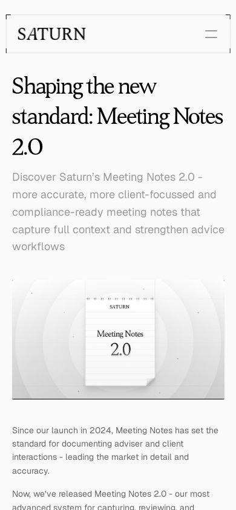 |

## Side by side
Added after the UI build, see [side-by-side](side-by-side.md).
